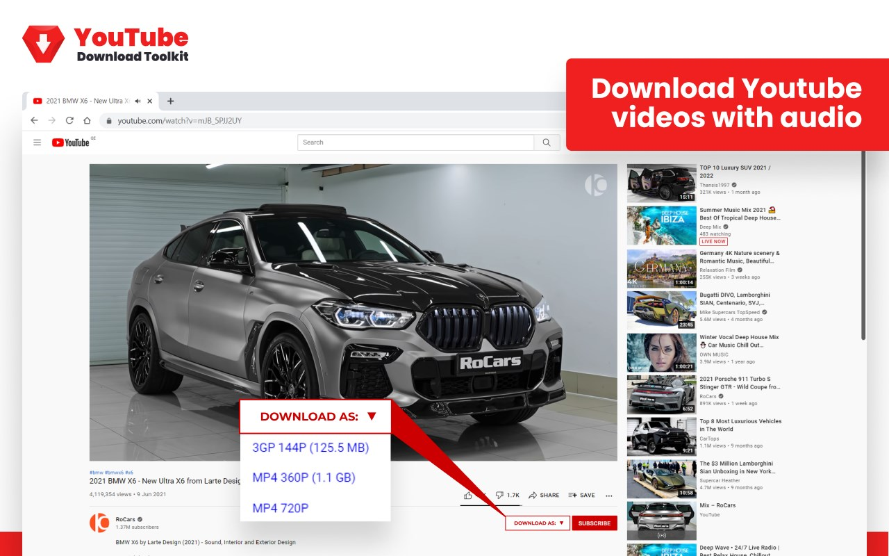
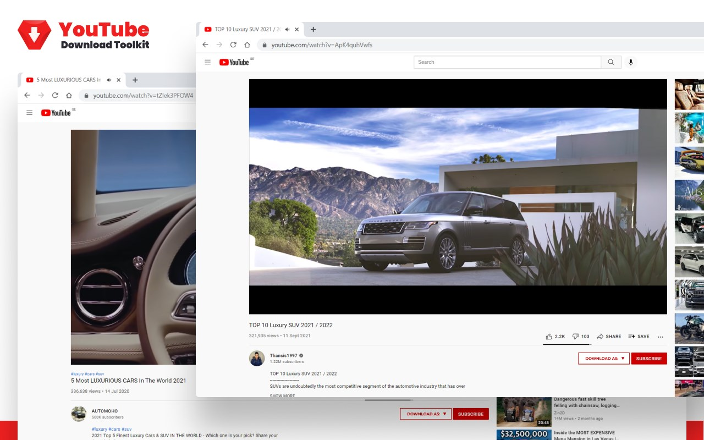

# Youtube Download toolkit extension

Chrome Web Store doesn't accept Youtube downloaders.
You can install this extension manually.

If you use Edge browser, install the extension here:
https://microsoftedge.microsoft.com/addons/detail/youtube-download-toolkit/gmoabalpmnmfdebmbimdjachmgfgcnpk

## Functionality

This exceptional browser extension allows you to download YouTube videos with audio.
Works in Chrome, Edge, Chromium, Opera. 

The main features are:
- ✨ Totally free - no fees or premium options
- ✨ Download videos with an audio track
- ✨ All nonHD resolutions and qualities are supported

After installation, you will have a button below the video that enables you to download videos.

## How to install the extension to Google Chrome

* Download source code in ZIP
* Unpack ZIP archive, remember location of "Youtube Download toolkit"
* Open extension page Open chrome://extensions 
* or Use the menu: ⋮ > More tools > Extensions
* Enable "Developer mode" in the upper-right corner of the page

## Screenshots

